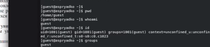
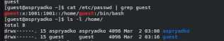
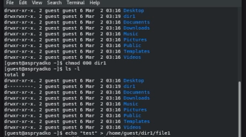
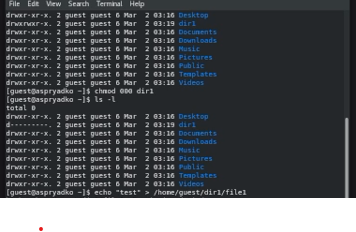
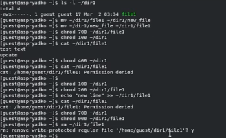

---
## Author
author:
  name: Алексей Прядко
  affiliation:
    - name: Российский университет дружбы народов
      country: Российская Федерация
      postal-code: 117198
      city: Москва
      address: ул. Миклухо-Маклая, д. 6

## Title
title: "Отчёт по лабораторной работе № 2"
subtitle: "Дискреционное разграничение прав в Linux. Основные атрибуты"
license: "CC BY"
---

# Цель работы

Получение практических навыков работы в консоли с атрибутами файлов, закрепление теоретических основ дискреционного разграничения доступа в современных системах на базе ОС Linux.

# Задание

1. Создать пользователя `guest` и установить пароль.
2. Изучить информацию о пользователе и группах.
3. Исследовать системные файлы и права на домашние директории.
4. Провести серию экспериментов по изменению прав доступа (chmod) на директории и файлы.
5. Заполнить таблицы разрешённых действий и минимальных прав.

# Теоретическое введение

Дискреционное разграничение доступа (DAC) — это управление доступом субъектов к объектам на основе списков управления доступом или матрицы доступа. В Linux основными атрибутами являются права на чтение (`r`), запись (`w`) и выполнение (`x`) для владельца, группы и остальных пользователей. Важно понимать, что права на директорию определяют возможность управления списком файлов внутри неё (создание, удаление, поиск).

# Выполнение лабораторной работы

### 1. Подготовка и изучение системы
Был создан пользователь `guest` (рис. @fig-001). После входа под новой учётной записью были проверены основные параметры: имя пользователя, ID и группы (рис. @fig-002).

{#fig-001 width=70%}

{#fig-002 width=70%}

Просмотрена информация в файле `/etc/passwd`. Установлено, что UID и GID соответствуют значению 1001. Также проверены права доступа к директории `/home/` (рис. @fig-003).

{#fig-003 width=70%}

### 2. Эксперименты с правами доступа
Создана директория `dir1`. После установки на неё прав `000` (полный запрет) любые операции внутри стали невозможны, включая создание файлов и просмотр содержимого (рис. @fig-004, @fig-005).

{#fig-004 width=70%}

{#fig-005 width=70%}

### 3. Исследование минимально необходимых прав
В ходе тестов было выявлено, что для чтения файла внутри директории достаточно права на выполнение (`x`) на саму директорию. Однако для удаления файла права на сам файл не требуются — необходимы права на запись (`w`) и выполнение (`x`) на родительскую директорию (рис. @fig-006).

{#fig-006 width=70%}

### 4. Результаты (Таблицы)

Ниже приведены итоговые таблицы, сформированные на основе проведенных опытов.

: Установленные права и разрешённые действия {#tbl-rights}

| Права директории | Права файла | Созд. файла | Удал. файла | Запись в файл | Чтение файла | Смена дир. (cd) | Просм. (ls) |Переим. файла |Смена атриб. (chmod) |
| :--- | :--- | :---: | :---: | :---: | :---: | :---: | :---: | :---: | :---: |
| **d (000)** | **(000)** | - | - | - | - | - | - | - | - |
| **d (100)** | **(000)** | - | - | - | - | + | - | - | + |
| **drwx (700)** | **-rwx (700)** | + | + | + | + | + | + |

: Минимальные права для совершения операций {#tbl-min-rights}

| Операция | Минимальные права на директорию | Минимальные права на файл |
| :--- | :---: | :---: |
| Создание файла | wx (3) | — |
| Удаление файла | wx (3) | — |
| Чтение файла | x (1) | r (4) |
| Запись в файл | x (1) | w (2) |
| Переименование | wx (3) | — |
| Создание поддиректории | wx (3) | — |
| Удаление поддиректории | wx (3) | — |

# Выводы

В ходе работы были изучены основы дискреционного управления доступом в Linux. Экспериментально подтверждено, что права на директорию имеют приоритетное значение для манипуляций с объектами внутри неё. Установлено, что право `x` на директорию необходимо для любого доступа к её содержимому, а право `w` на директорию позволяет удалять файлы, даже если у пользователя нет прав на сам файл.

# Список литературы{.unnumbered}

1. Кулябов Д. С. и др. Информационная безопасность компьютерных сетей. Лабораторная работа №2.