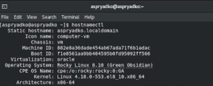
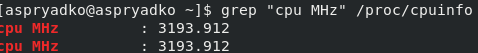
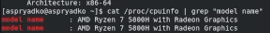
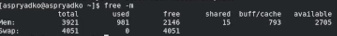
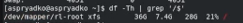
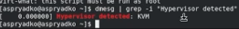
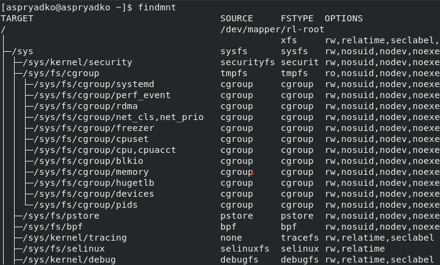

---
## Author
author:
  name: Алексей С. Прядко
  affiliation:
    - name: Российский университет дружбы народов
      country: Российская Федерация
      city: Москва

## Title
title: "Отчёт по лабораторной работе №1"
subtitle: "Установка и конфигурация операционной системы на виртуальную машину"
license: "CC BY"
---

# Цель работы

Приобретение практических навыков установки операционной системы на виртуальную машину, настройки минимально необходимых для дальнейшей работы сервисов.

# Задание

1. Создать виртуальную машину с именем `aspryadko`.
2. Установить ОС Rocky Linux 8.10.
3. Собрать техническую информацию о системе (ядро, процессор, память, монтирование).

# Теоретическое введение

VirtualBox — это программное обеспечение для виртуализации, позволяющее запускать гостевые ОС внутри основной системы. Rocky Linux является дистрибутивом, построенным на базе исходного кода RHEL (Red Hat Enterprise Linux) и обеспечивающим полную бинарную совместимость с ним.

# Выполнение лабораторной работы

## Установка ОС

В процессе работы была создана виртуальная машина со следующими параметрами:
- **Имя:** aspryadko
- **ОС:** Red Hat (64-bit)
- **Память:** 4096 MB
- **Диск:** 40 GB

При установке было задано имя хоста `aspryadko.localdomain` и создан пользователь `aspryadko` с правами администратора.

## Сбор сведений о системе

В ходе выполнения работы были выполнены команды в терминале для получения характеристик ОС:

1. **Версия ядра Linux.** Использована команда `hostnamectl` ([рис. @fig-001]).
{#fig-001 width=70%}

2. **Частота процессора (Detected Mhz).** Извлечена из системного файла `/proc/cpuinfo` ([рис. @fig-002]).
{#fig-002 width=70%}

3. **Модель процессора.** Данные извлечены из `/proc/cpuinfo` ([рис. @fig-003]).
{#fig-003 width=70%}

4. **Объем оперативной памяти.** Использована команда `free -m` ([рис. @fig-004]).
{#fig-004 width=70%}

5. **Тип файловой системы.** Использована команда `df -Th` ([рис. @fig-005]).
{#fig-005 width=70%}

6. **Тип гипервизора.** Использована команда `virt-what` ([рис. @fig-006]).
{#fig-006 width=70%}

7. **Последовательность монтирования файловых систем.** Получена с помощью команды `findmnt` ([рис. @fig-007]).
{#fig-007 width=70%}

# Ответы на контрольные вопросы

1. **Какую информацию содержит учётная запись пользователя?**
   Учётная запись включает: логин, идентификаторы UID и GID, полное имя (GECOS), домашний каталог, командную оболочку и хеш пароля.

2. **Команды терминала:**
   - Справка: `man ls`, `mkdir --help`.
   - Перемещение: `cd /etc`.
   - Просмотр: `ls -la`.
   - Объём каталога: `du -sh`.
   - Создание/удаление: `mkdir folder`, `rm file.txt`.
   - Задание прав: `chmod 755 script.sh`.
   - История: `history`.

3. **Что такое файловая система?**
   Это способ организации хранения данных. Примеры: **XFS** (высокая производительность), **Ext4** (надежность/журналирование), **NTFS** (стандарт Windows).

4. **Как посмотреть подмонтированные ФС?**
   С помощью команд `mount` или `df -Th`.

5. **Как удалить зависший процесс?**
   Команда `kill <PID>`, для принудительного завершения — `kill -9 <PID>`.

# Выводы

Я научился создавать виртуальные машины в VirtualBox, устанавливать Rocky Linux и использовать базовые команды терминала для анализа системы.

# Список литературы{.unnumbered}

::: {#refs}
:::