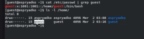
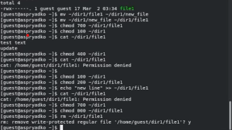

---
## Author
author:
  name: Алексей Прядко
  affiliation:
    - name: Российский университет дружбы народов
      country: Российская Федерация

## Title
title: "Лабораторная работа № 2"
subtitle: "Дискреционное разграничение прав в Linux. Основные атрибуты"
license: "CC BY"
date: today
date-format: "YYYY-MM-DD"

## Format
format: pptx
---

# Цель и задачи

## Цель работы

- Получение навыков работы с атрибутами файлов
- Закрепление основ дискреционного разграничения доступа
- Работа в консоли Linux

## Задачи

1. Создать пользователя `guest`
2. Изучить системные файлы и атрибуты
3. Провести эксперименты с правами (`chmod`)
4. Определить минимальные права для операций

# Ход работы

## 1. Информация о пользователе

- Пользователь: `guest`
- UID/GID: 1001
- Группы: `guest`

## 2. Системные файлы

- Просмотр `/etc/passwd`
- Сравнение с данными команды `id`

## 3. Блокировка доступа

- Создание директории `dir1`
- Установка прав `000`
- Полный запрет на любые действия

## 4. Частичный доступ

- Права `100` (`--x`) на директорию
- Вход в папку (`cd`) разрешен
- Просмотр (`ls`) и создание файлов запрещены

## 5. Полный доступ

- Права `700` (`rwx`)
- Разрешены все операции с файлами

## 6. Минимальные права

- Чтение файла требует `x` на папку и `r` на файл
- Удаление файла требует `wx` на папку

# Результаты

## Таблица 2.1. Разрешённые действия

| Права дир. | Права файла | Созд. | Удал. | Зап. | Чтен. | cd | ls | chmod |
| :--- | :---: | :---: | :---: | :---: | :---: | :---: | :---: | :---: |
| d (000) | 0 | - | - | - | - | - | - | - |
| d (100) | 0 | - | - | - | - | + | - | + |
| d (700) | 700 | + | + | + | + | + | + | + |

## Таблица 2.2. Минимальные права

| Операция | Права на директорию | Права на файл |
| :--- | :--- | :--- |
| Создание файла | wx (3) | — |
| Удаление файла | wx (3) | — |
| Чтение файла | x (1) | r (4) |
| Запись в файл | x (1) | w (2) |
| Переименование | wx (3) | — |
| Созд. поддир. | wx (3) | — |
| Удал. поддир. | wx (3) | — |

# Выводы

## Итог

- Права на директорию приоритетны для операций с файлами
- Атрибут `x` на директорию необходим для доступа к содержимому
- Удаление файла — это операция изменения директории