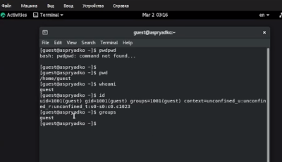
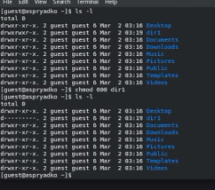
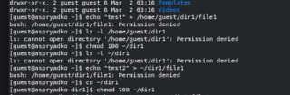
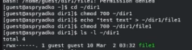

---
## Author
author:
  name: Алексей Прядко
  affiliation:
    - name: Российский университет дружбы народов
      country: Российская Федерация

## Title
title: "Отчёт по лабораторной работе № 2"
subtitle: "Дискреционное разграничение прав в Linux. Основные атрибуты"
license: "CC BY"

## Format
format: docx
---

# Цель работы

Получение практических навыков работы в консоли с атрибутами файлов, закрепление теоретических основ дискреционного разграничения доступа в современных системах на базе ОС Linux.

# Задание

1.  Создать учётную запись пользователя `guest`.
2.  Задать пароль.
3.  Определить директорию, имя пользователя и группы.
4.  Сравнить информацию с системными файлами.
5.  Изменить права доступа к директории и файлам.
6.  Проверить выполнение операций при разных правах.
7.  Заполнить таблицы установленных прав и минимально необходимых прав.

# Выполнение лабораторной работы

## 1. Подготовка и сбор информации
В системе была создана учётная запись пользователя `guest` и задан пароль. После входа в систему были определены текущая директория (`pwd`), имя пользователя (`whoami`) и группы (`id`, `groups`).

## 2. Работа с системными файлами
Был просмотрен файл `/etc/passwd`. Найденная запись `guest:x:1001:1001...` подтвердила данные, полученные ранее (UID=1001, GID=1001). Также были просмотрены права на домашнюю директорию.

## 3. Изменение прав доступа (chmod)
В домашней директории была создана поддиректория `dir1`. С неё были сняты все атрибуты прав доступа командой `chmod 000 dir1`.

## 4. Проверка отказов в доступе
При попытке создать файл в директории без прав (`000`) система выдала ошибку "Permission denied". Аналогичная ошибка возникла при попытке просмотреть содержимое (`ls`). Однако при установке прав `100` (`--x`) удалось зайти в директорию.

## 5. Проверка полных прав
Были восстановлены полные права (`700`) на директорию и файл. Проверено успешное выполнение операций создания, чтения и переименования файлов.

## 6. Определение минимальных прав
Проведены эксперименты для определения минимальных прав. Установлено, что права на директорию (особенно `x` и `w`) критически важны для работы с файлами внутри неё. Удаление файла возможно даже без прав на сам файл, если есть права на запись в директорию.

# Результаты

Таблица 2.1. Установленные права и разрешённые действия

| Права директории | Права файла | Созд. файла | Удал. файла | Запись в файл | Чтение файла | Смена дир. (cd) | Просм. файлов | Переим. файла | Смена атриб. (chmod) |
| :--- | :--- | :---: | :---: | :---: | :---: | :---: | :---: | :---: | :---: |
| d (000) | 0 | - | - | - | - | - | - | - | - |
| d--x------ (100) | 0 | - | - | - | - | + | - | - | + |
| drwx------ (700) | -rwx------ (700) | + | + | + | + | + | + | + | + |

Таблица 2.2. Минимальные права для совершения операций

| Операция | Минимальные права на директорию | Минимальные права на файл |
| :--- | :--- | :--- |
| Создание файла | wx (3) | — |
| Удаление файла | wx (3) | — |
| Чтение файла | x (1) | r (4) |
| Запись в файл | x (1) | w (2) |
| Переименование файла | wx (3) | — |
| Создание поддиректории | wx (3) | — |
| Удаление поддиректории | wx (3) | — |

# Выводы

В ходе выполнения лабораторной работы были получены практические навыки работы с атрибутами файлов в Linux. Было установлено, что права на директорию определяют возможность изменения списка файлов (создание, удаление, переименование), в то время как права на файл регулируют доступ к содержимому самого файла.