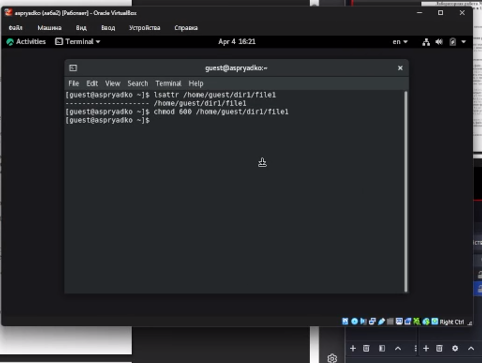
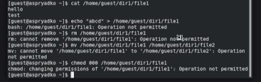
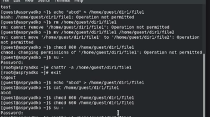
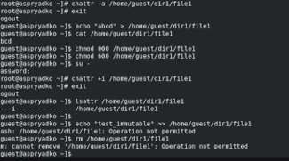

---
## Author
author:
  name: Прядко Алексей Семенович
  affiliation:
    - name: Российский университет дружбы народов
      country: Российская Федерация
      city: Москва
## Title
title: Лабораторная работа № 4
subtitle: Дискреционное разграничение прав в Linux. Расширенные атрибуты
license: CC BY
date: today
date-format: "YYYY-MM-DD"

format:
  revealjs:
    theme: beige
    slide-number: true
    embed-resources: true
    width: 1400
    height: 900
    css: |
      .reveal h1 { font-size: 2.0em !important; text-transform: none !important; }
      .reveal h2 { font-size: 1.6em !important; text-transform: none !important; }
---

## Докладчик

  * [Прядко Алексей Семенович]
  * Российский университет дружбы народов

# Вводная часть

## Актуальность

- Стандартных дискреционных прав (чтение, запись, выполнение) не всегда достаточно.
- Владелец файла может случайно удалить или испортить важные данные.
- Расширенные атрибуты (такие как `a` и `i`) позволяют создать дополнительный уровень защиты на уровне файловой системы.
- Управлять данными атрибутами имеет право только администратор системы.

## Цели и задачи

**Цель:** 
Получение практических навыков работы в консоли ОС Linux с расширенными атрибутами файлов.

**Задачи:**

1. Изучить работу утилит `lsattr` и `chattr`.
2. Проверить механизм защиты с помощью атрибута `a` (append-only).
3. Проверить механизм абсолютной блокировки с помощью атрибута `i` (immutable).

# Выполнение лабораторной работы

## Базовые права и атрибуты

- С помощью команды `lsattr` проверены текущие расширенные атрибуты тестового файла.
- Командой `chmod 600` установлены права на чтение и запись только для владельца.

{width=60%}

## Попытка управления от обычного пользователя

- Обычный пользователь (`guest`) попытался установить расширенный атрибут.
- Система заблокировала действие (Operation not permitted).

{width=60%}

## Установка атрибута "a" суперпользователем

- Права повышены до администратора (`su -`).
- Успешно установлен атрибут `a` (append-only) с помощью команды `chattr +a`.

{width=60%}

## Проверка разрешенных действий (дозапись)

- Атрибут `a` разрешает исключительно добавление информации в конец файла.
- Команда `echo "test" >> file1` выполнилась успешно.

{width=60%}

## Проверка запрещенных действий

- Атрибут `a` блокирует удаление (`rm`), переименование (`mv`), перезапись (`>`) и изменение базовых прав доступа.
- Все попытки выполнить эти действия завершились ошибкой доступа.

{width=60%}

## Снятие расширенного атрибута

- Администратор снял защиту командой `chattr -a`.
- После этого файл снова стал доступен для перезаписи и изменения прав (`chmod 000`).

{width=60%}

## Тестирование атрибута "i" (immutable)

- От имени `root` установлен атрибут `i`.
- Данный атрибут делает файл абсолютно неизменяемым: запрещено удаление и **даже дозапись**.

{width=60%}

# Результаты и выводы

## Выводы

- Получены практические навыки работы в консоли с расширенными атрибутами файлов в ОС Linux.
- Установлено, что атрибут `a` эффективно защищает файл от удаления и перезаписи, оставляя возможность вести логи (дозапись).
- Установлено, что атрибут `i` делает файл полностью "каменным" (неизменяемым).
- Подтверждено, что управлять политикой расширенных атрибутов может исключительно суперпользователь (`root`).