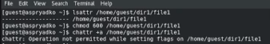
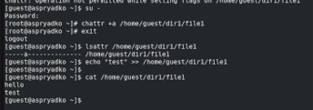
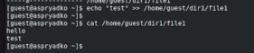

---
## Author
author:
  name: [Прядко Алексей Семенович]
  affiliation:
    - name: Российский университет дружбы народов
      country: Российская Федерация
      city: Москва

## Title
title: "Отчёт по лабораторной работе № 4"
subtitle: "Основы информационной безопасности. Дискреционное разграничение прав в Linux. Расширенные атрибуты"
license: "CC BY"
---

# Цель работы

Получение практических навыков работы в консоли с расширенными атрибутами файлов.

# Задание

1. Изучение текущих атрибутов файла и установка базовых прав доступа.
2. Проверка возможности установки расширенных атрибутов от имени обычного пользователя.
3. Установка атрибута `a` (append-only) от имени суперпользователя и проверка его работы (проверка дозаписи, попытки удаления, перезаписи, переименования).
4. Снятие атрибута `a` и проверка восстановления стандартного поведения файла.
5. Установка атрибута `i` (immutable) и проверка полного запрета на изменение файла.

# Теоретическое введение

В операционных системах семейства Linux, помимо стандартных прав доступа (чтение `r`, запись `w`, выполнение `x`), существуют расширенные атрибуты файлов. Они позволяют более тонко настраивать политику безопасности и защищать файлы даже от случайных действий их владельцев.

Для управления расширенными атрибутами используются две основные утилиты:
- `lsattr` — просмотр расширенных атрибутов файлов и каталогов.
- `chattr` — изменение расширенных атрибутов.

В данной работе рассматриваются два атрибута:
- **`a` (append-only)**: Файл с этим атрибутом может быть открыт только в режиме дозаписи. Его нельзя удалить, переименовать, стереть или перезаписать его содержимое.
- **`i` (immutable)**: Файл становится полностью неизменяемым. Запрещены любые модификации, включая удаление, переименование, создание ссылок и запись (даже дозапись). 

Устанавливать и снимать данные атрибуты имеет право только суперпользователь (`root`).

# Выполнение лабораторной работы

Подготовив тестовый файл `/home/guest/dir1/file1`, я определил его текущие расширенные атрибуты с помощью команды `lsattr` и установил базовые права, разрешающие чтение и запись только владельцу (команда `chmod 600`) (рис. @fig-001).

{#fig-001 width=70%}

Далее я попытался установить на файл расширенный атрибут `a` (append-only) от имени обычного пользователя `guest` с помощью команды `chattr +a`. В ответ система предсказуемо выдала отказ в доступе (Operation not permitted), так как эти действия разрешены только администратору (рис. @fig-002).

{#fig-002 width=70%}

Для продолжения работы я повысил свои права до суперпользователя (команда `su -`) и успешно установил атрибут `a` на файл. Вернувшись в учетную запись `guest`, я проверил атрибуты командой `lsattr` и убедился, что флаг `a` успешно применен (рис. @fig-003).

{#fig-003 width=70%}

Атрибут `a` разрешает только дозапись в конец файла. Я проверил это, выполнив команду `echo "test" >> /home/guest/dir1/file1` и прочитав файл с помощью `cat`. Слово "test" было успешно добавлено (рис. @fig-004).

{#fig-004 width=70%}

Затем я попытался выполнить действия, которые атрибут `a` должен блокировать: перезаписать файл (`>`), удалить его (`rm`), переименовать (`mv`) и лишить файл всех прав доступа (`chmod 000`). Во всех случаях система пресекла попытки и выдала ошибку "Отказано в доступе" (рис. @fig-005).

{#fig-005 width=70%}

Чтобы продолжить эксперименты, я снова перешел в режим суперпользователя и снял атрибут с помощью команды `chattr -a`. После этого я повторил заблокированные ранее операции. Теперь перезапись файла и смена прав доступа (`chmod 000`) прошли успешно. После проверки я вернул права `chmod 600` (рис. @fig-006).

{#fig-006 width=70%}

На последнем этапе я перешел к тестированию атрибута `i` (immutable - неизменяемый). Перейдя в консоль с правами администратора, я установил этот атрибут (`chattr +i`). 
Попытавшись дозаписать информацию в файл (`echo "test_immutable" >> ...`) и удалить его, я вновь получил отказ в доступе. В отличие от атрибута `a`, атрибут `i` блокирует абсолютно любые изменения файла, включая дозапись (рис. @fig-007).

{#fig-007 width=70%}

# Выводы

В ходе выполнения лабораторной работы я получил практические навыки работы в консоли Linux с расширенными атрибутами файлов. Я убедился, что стандартных дискреционных прав (чтение, запись, выполнение) не всегда достаточно для надежной защиты файлов. 

С помощью утилиты `chattr` я на практике изучил работу атрибута `a` (append-only), который разрешает только дозапись в конец файла, защищая его от удаления и перезаписи, а также атрибута `i` (immutable), который делает файл абсолютно неизменяемым. Я также на практике подтвердил, что управлять данными расширенными атрибутами имеет право исключительно суперпользователь (root).

# Список литературы{.unnumbered}

1. Курс Основы информационной безопасности(38.03.05) РУДН
