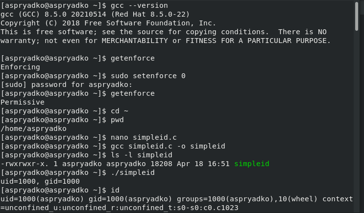
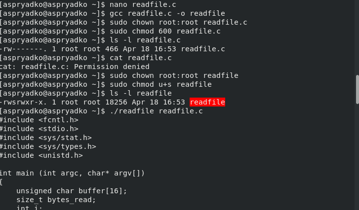
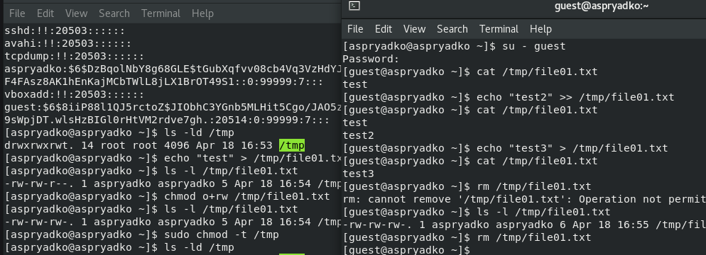
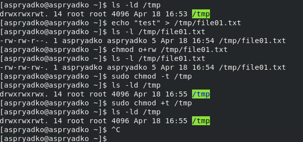

# Информация

## Докладчик

:::::::::::::: {.columns align=center}
::: {.column width="70%"}

  * Алексей Прядко
  * НБИбд-01-24
  * Кафедра информационной безопасности

:::
::: {.column width="30%"}

:::
::::::::::::::

# Вводная часть

## Актуальность

- В Linux права доступа — основа безопасности
- SetUID и SetGID позволяют процессам временно повышать привилегии
- Sticky-бит защищает общие каталоги от случайного удаления файлов
- Понимание этих механизмов необходимо администраторам и специалистам по ИБ

## Цели и задачи

**Цель:** изучить механизмы изменения идентификаторов процессов и влияние Sticky-бита.

**Задачи:**
1. Написать программы для отображения UID/GID
2. Исследовать SetUID и SetGID на примере
3. Проверить возможность чтения защищённого файла через SetUID
4. Изучить работу Sticky-бита на каталоге `/tmp`

# Ход выполнения работы

## Подготовка стенда

- Проверка наличия GCC: `gcc --version`
- Отключение SELinux: `setenforce 0`
- Создание пользователя `guest2` (использован существующий `guest`)

{width=90%}

## Программа simpleid и реальные ID

- Создан `simpleid.c`, выводящий `uid` и `gid`
- Результат совпадает с командой `id`
- Пользователь `aspryadko` → UID=1000, GID=1000

{width=70%}

## Программа simpleid2: реальные и эффективные ID

- Добавлены `getuid()/geteuid()`, `getgid()/getegid()`
- Изначально реальные и эффективные ID совпадают
- После установки SetUID (владелец root) эффективный UID становится 0

{width=90%}

## Исследование SetGID

- SetUID снят, установлен SetGID
- Группа-владелец остаётся root
- Эффективный GID становится 0, UID возвращается к 1000

{width=90%}

## Программа readfile: доступ к защищённому файлу

- Программа читает любой файл, переданный аргументом
- Файл `readfile.c` защищён (`600`, владелец root)
- Обычный пользователь не может прочитать (`Permission denied`)
- После установки SetUID на `readfile` программа читает и `readfile.c`, и `/etc/shadow`

{width=90%}

## Sticky-бит на `/tmp`: проверка при включённом t

- `/tmp` имеет бит `t` (`drwxrwxrwt`)
- Файл создан пользователем `aspryadko`, права `o+rw`
- Пользователь `guest` может читать, дописывать, перезаписывать
- Удалить файл **не может** (`Operation not permitted`)

{width=90%}

## Sticky-бит на `/tmp`: после снятия t

- Команда `sudo chmod -t /tmp` убирает бит
- Пользователь `guest` успешно удаляет файл
- Возврат бита: `sudo chmod +t /tmp`

{width=90%}

# Результаты

## Основные выводы

- **SetUID** изменяет эффективный UID на владельца файла
- **SetGID** аналогично действует на эффективный GID
- Программа с SetUID от root может читать защищённые файлы
- **Sticky-бит** предотвращает удаление чужих файлов в общих каталогах

# Заключение

## Итоги

- Лабораторная работа выполнена в полном объёме
- Изучены SetUID, SetGID и Sticky-биты
- Результаты подтверждены скриншотами
- Полученные знания применимы в администрировании и ИБ

## Спасибо за внимание!

