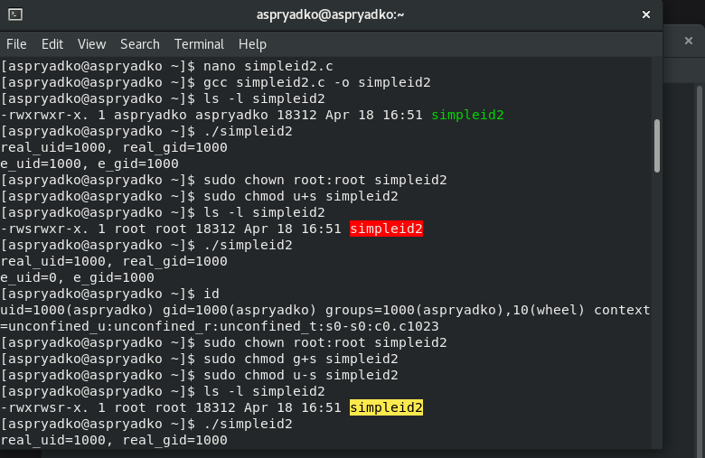
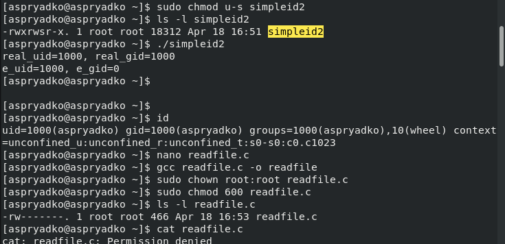

---
## Author
author:
  name: Алексей Прядко
  affiliation:
    - name: Ваш университет
      country: Россия

## Title
title: "Изучение механизмов SetUID, SetGID и Sticky-битов в Linux"
subtitle: "Отчёт по лабораторной работе №5"
license: "CC BY"
---

# Цель работы

Изучение механизмов изменения идентификаторов процессов с помощью SetUID- и SetGID-битов, а также исследование влияния Sticky-бита на операции записи и удаления файлов в общих директориях. Получение практических навыков работы в консоли с дополнительными атрибутами файлов и понимания особенностей безопасности в ОС Linux.

# Задание

1. Подготовить лабораторный стенд: проверить наличие компилятора gcc, отключить SELinux, создать тестовых пользователей.
2. Написать и скомпилировать программы на языке C, демонстрирующие реальные и эффективные идентификаторы пользователя и группы.
3. Исследовать влияние SetUID-бита на смену эффективного идентификатора пользователя.
4. Исследовать влияние SetGID-бита на смену эффективного идентификатора группы.
5. Реализовать программу чтения файла и проверить возможность доступа к защищённому файлу с использованием SetUID.
6. Изучить работу Sticky-бита на каталоге `/tmp`: проверить возможность записи, дозаписи и удаления файла от имени другого пользователя до и после снятия бита.
7. Оформить отчёт с описанием выполненных действий и анализом результатов.

# Теоретическое введение

В операционных системах семейства Unix/Linux каждый процесс характеризуется реальным и эффективным идентификаторами пользователя (UID) и группы (GID). Реальный идентификатор определяет владельца процесса, эффективный — права, используемые при проверке доступа к файлам и другим ресурсам. Обычно они совпадают, но могут различаться благодаря специальным битам в правах доступа исполняемых файлов: **SetUID** (SUID) и **SetGID** (SGID).

Если на исполняемом файле установлен бит SetUID, то при его запуске эффективный UID процесса становится равным UID владельца файла, а не пользователя, запустившего программу. Аналогично, SetGID-бит изменяет эффективный GID на группу-владельца файла. Этот механизм широко используется системными утилитами (например, `passwd`, `sudo`), однако требует осторожности, так как может привести к повышению привилегий и угрозам безопасности.

**Sticky-бит** (обозначается символом `t`) применяется к каталогам и ограничивает удаление файлов. В каталоге с установленным Sticky-битом удалить файл может только его владелец, владелец каталога или суперпользователь, даже если права на запись в каталог предоставлены всем пользователям. Классический пример — каталог `/tmp`, доступный для записи всем, но защищённый от случайного удаления чужих временных файлов.

# Выполнение лабораторной работы

## 1. Подготовка стенда и программа `simpleid`

На начальном этапе была проверена установка компилятора `gcc` (версия 8.5.0) и временно отключён SELinux командой `setenforce 0`, чтобы избежать блокировок (рис. @fig-step1). Затем создана первая программа `simpleid.c`, выводящая реальные UID и GID процесса. После компиляции и запуска её вывод совпал с результатом системной команды `id`.

{#fig-step1 width=100%}

## 2. Программа `simpleid2` и исследование SetUID

Для демонстрации различий между реальными и эффективными идентификаторами была написана программа `simpleid2.c`. При обычном запуске оба UID равны идентификатору пользователя `aspryadko` (1000). Затем владельцем файла был назначен `root`, и установлен SetUID-бит. После этого эффективный UID стал равен 0 (root), в то время как реальный UID остался прежним (рис. @fig-step2).

{#fig-step2 width=100%}

## 3. Исследование SetGID-бита

Далее SetUID-бит был снят, а вместо него установлен SetGID. Права на файл были изменены так, чтобы группа-владелец оставалась `root`. При запуске программы эффективный GID сменился на 0 (группа root), а эффективный UID вернулся к значению 1000 (рис. @fig-step3).

{#fig-step3 width=100%}

## 4. Чтение защищённого файла с помощью SetUID

Была реализована программа `readfile.c`, принимающая имя файла в качестве аргумента и выводящая его содержимое. Файл `readfile.c` был защищён: права доступа `600` и владелец `root`, в результате чего пользователь `aspryadko` не мог прочитать его командой `cat`. Однако после компиляции программы `readfile`, смены её владельца на `root` и установки SetUID-бита, программа смогла прочитать как сам исходный файл, так и системный файл `/etc/shadow`, доступный только суперпользователю. Это наглядно демонстрирует, как SetUID может использоваться для контролируемого повышения привилегий и одновременно представляет угрозу безопасности при некорректном использовании (рис. @fig-step4).

{#fig-step4 width=100%}

## 5. Исследование Sticky-бита на каталоге `/tmp`

На каталоге `/tmp` изначально был установлен Sticky-бит (`drwxrwxrwt`). Пользователь `aspryadko` создал файл `file01.txt` и предоставил права на чтение и запись для всех. Затем был осуществлён вход под пользователем `guest`. Пользователь `guest` смог прочитать файл, дозаписать в него данные (`>>`), полностью перезаписать его (`>`), но при попытке удаления получил ошибку `Operation not permitted` (рис. @fig-step5).

{#fig-step5 width=100%}

После снятия Sticky-бита (`sudo chmod -t /tmp`) пользователь `guest` без проблем удалил файл командой `rm`, что подтверждает: именно Sticky-бит защищал чужие файлы от удаления (рис. @fig-step6). В конце бит был возвращён.

{#fig-step6 width=100%}

# Выводы

В результате выполнения лабораторной работы были получены практические навыки работы с дополнительными атрибутами файлов в Linux:

- Установка SetUID-бита на исполняемый файл приводит к тому, что процесс получает эффективный UID владельца файла, что может использоваться для временного повышения привилегий.
- SetGID-бит аналогичным образом изменяет эффективный GID процесса.
- Программа с установленным SetUID от root способна читать файлы, недоступные обычному пользователю, что подтверждает необходимость осторожного использования данного механизма.
- Sticky-бит на каталоге `/tmp` предотвращает удаление файлов пользователями, не являющимися их владельцами, даже при наличии прав на запись в каталог.

Полученные знания важны для понимания принципов разграничения доступа и обеспечения информационной безопасности в операционных системах Unix/Linux.

# Список литературы{.unnumbered}

1. Методические указания к лабораторной работе №5 «Дискреционное управление доступом. SetUID- и Sticky-биты».
2. Таненбаум Э., Бос Х. Современные операционные системы. — 4-е изд. — СПб.: Питер, 2015.
3. Роббинс А. Bash. Карманный справочник системного администратора. — М.: Вильямс, 2017.