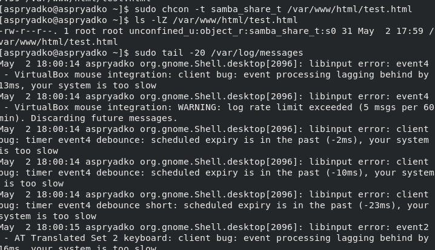
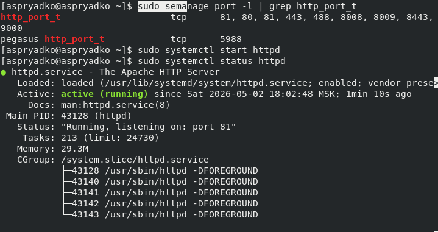

# Информация

## Докладчик

:::::::::::::: {.columns align=center}
::: {.column width="70%"}

  * Алексей Прядко

:::
::: {.column width="30%"}

:::
::::::::::::::

# Вводная часть

## Актуальность

- SELinux – мандатный контроль доступа (MAC), встроенный в ядро Linux
- Ограничивает действия процессов над объектами (файлами, портами)
- Работает в режиме enforcing, политика targeted
- Критичен для безопасности веб-серверов и других служб

## Цели и задачи

**Цель:** Познакомиться с технологией SELinux на примере веб-сервера Apache.

**Задачи:**
1. Подготовить стенд, запустить Apache, убедиться в enforcing
2. Изучить контексты процессов и файлов
3. Продемонстрировать блокировку доступа при неверном контексте
4. Исследовать управление портами через SELinux
5. Научиться анализировать логи SELinux

# Ход выполнения работы

## Подготовка стенда

- Установка Apache (`yum install -y httpd`)
- Проверка SELinux: `getenforce`, `sestatus` (режим enforcing, политика targeted)
- Отключение файрвола
- Запуск и включение автозагрузки Apache

{width=85%}

## Контекст процессов и переключатели

- `ps -eZ | grep httpd` – процессы работают в домене `httpd_t`
- `getsebool -a | grep httpd` – большинство булевых опций выключены
- Политика targeted изолирует только уязвимые службы

{width=85%}

## Метки файлов и создание test.html

- `/var/www/html` имеет тип `httpd_sys_content_t`
- Создан файл `test.html` – ему унаследован этот тип
- Доступ успешен: `curl http://127.0.0.1/test.html` возвращает `test`

{width=85%}

## Изменение контекста и блокировка

- Контекст изменён на `samba_share_t` (`chcon -t samba_share_t ...`)
- `curl` получает ошибку 403 (Forbidden)
- Классические права `-rw-r--r--` остаются, но SELinux запрещает чтение

{width=85%}

## Логирование запретов SELinux

- `/var/log/audit/audit.log` – записи `avc: denied { getattr }`
- `/var/log/messages` – сообщения `setroubleshoot` с рекомендациями
- `/var/log/httpd/error_log` – `Permission denied`

## Возврат контекста и восстановление доступа

- `chcon -t httpd_sys_content_t /var/www/html/test.html`
- `curl http://127.0.0.1/test.html` снова отдаёт содержимое
- Без изменения прав доступа доступ восстановлен

{width=60%}

## Перенос Apache на порт 81

- В `/etc/httpd/conf/httpd.conf` изменено `Listen 80` на `Listen 81`
- Перезапуск Apache – сервер слушает порт 81
- Порт 81 уже находился в `http_port_t` (проверено `semanage port -l`)
- `curl http://127.0.0.1:81/test.html` – успешно

{width=85%}

## Возврат к порту 80 и очистка

- Конфигурация возвращена на `Listen 80`
- Порт 81 удалён из политики (`semanage port -d -t http_port_t -p tcp 81`)
- Удалён тестовый файл

{width=85%}

# Результаты

## Основные выводы

- SELinux контролирует доступ на основе контекстов безопасности (типов)
- Изменение типа файла на неразрешённый блокирует чтение даже при `rw-r--r--`
- Логи аудита (`audit.log`, `messages`, `error_log`) содержат информацию о запретах
- Управление портами через `semanage port` позволяет разрешать нужные сетевые подключения
- Получены практические навыки работы с `chcon`, `restorecon`, `semanage`, `getsebool`, анализом логов

# Заключение

## Итоги

- Лабораторная работа выполнена в полном объёме
- Продемонстрирована работа SELinux в режиме enforcing с веб-сервером Apache
- Изучены механизмы блокировки доступа к файлам и портам
- Навыки администрирования Linux расширены в области мандатного управления доступом

## Спасибо за внимание!

Вопросы?