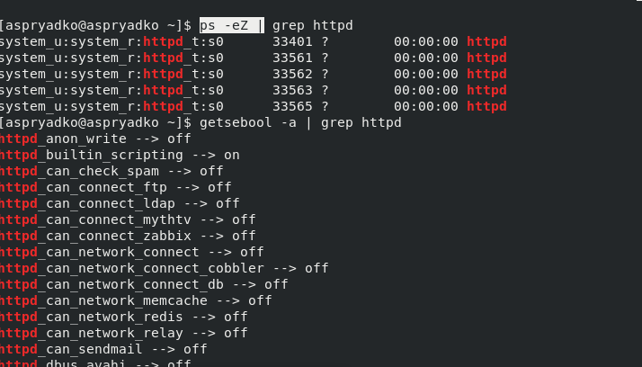
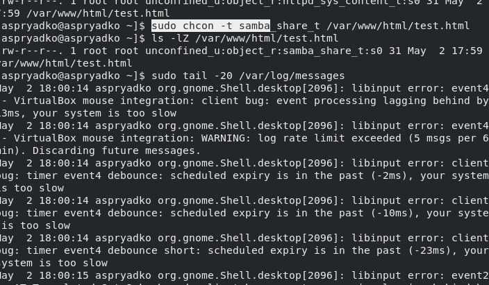
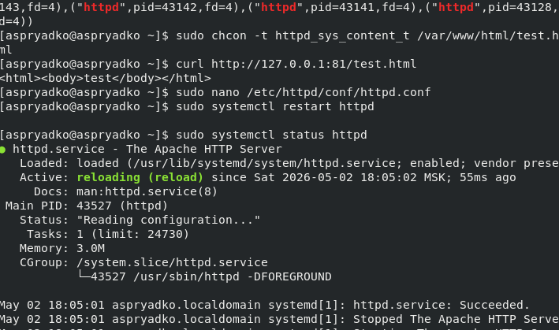
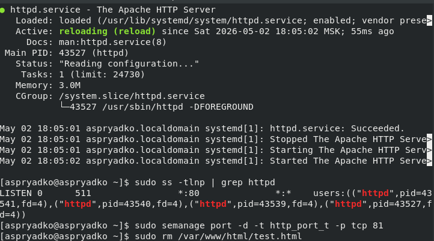

---
## Author
author:
  name: Алексей Прядко
  affiliation:
      country: Россия

## Title
title: "Мандатное разграничение прав в Linux (SELinux)"
subtitle: "Отчёт по лабораторной работе №6"
license: "CC BY"
---

# Цель работы

Развить навыки администрирования ОС Linux. Получить первое практическое знакомство с технологией SELinux. Проверить работу SELinux на практике совместно с веб-сервером Apache.

# Задание

1. Подготовить лабораторный стенд: установить и запустить веб-сервер Apache, отключить файрвол, убедиться, что SELinux работает в режиме enforcing с политикой targeted.
2. Определить SELinux-контекст процессов httpd, изучить булевы переключатели.
3. Проанализировать метки файлов в `/var/www`, создать тестовый HTML-файл и проверить доступ к нему.
4. Изменить контекст файла на неразрешённый для httpd, продемонстрировать блокировку доступа и проанализировать логи SELinux.
5. Вернуть разрешённый контекст и восстановить доступ.
6. Перенести Apache на порт 81, исследовать управление сетевыми портами через SELinux, проверить доступ.
7. Вернуть стандартный порт 80, удалить временные объекты.
8. Оформить отчёт.

# Теоретическое введение

**SELinux** (Security-Enhanced Linux) – реализация мандатного контроля доступа (MAC), встроенная в ядро Linux. В отличие от дискреционного управления, SELinux ограничивает действия субъектов (процессов) над объектами (файлами, портами) на основе централизованной политики. Основные компоненты:

- **Контекст безопасности** – метка вида `пользователь:роль:тип:уровень`, присваиваемая каждому субъекту и объекту. Тип (type) является ключевым элементом политики.
- **Домен процесса** – тип, определяющий набор разрешённых действий.
- **Политика targeted** – в современных дистрибутивах по умолчанию ограничиваются только наиболее уязвимые службы (например, httpd, sshd), остальные процессы работают в неограниченном домене `unconfined_t`.
- **Режимы работы**: `enforcing` – запрещающий с аудитом, `permissive` – только аудит без блокировки, `disabled`.
- Управление портами: SELinux контролирует, к каким портам могут привязываться сервисы, с помощью типа порта (например, `http_port_t`).
- Утилиты: `ps -Z`, `ls -Z` – просмотр контекстов; `chcon` – временное изменение контекста; `restorecon` – восстановление контекста по правилам; `semanage` – управление политикой; `getsebool` – просмотр логических переключателей; `sealert` – анализ ошибок SELinux.

В лабораторной работе используется дистрибутив Rocky Linux 8 с политикой `targeted` и режимом `enforcing`.

# Выполнение лабораторной работы

## 1. Подготовка стенда

Проверено отсутствие пакета `httpd`, затем он установлен командой `sudo yum install -y httpd`. SELinux находится в режиме `enforcing` (`getenforce`), политика `targeted` (`sestatus`). Файрвол отключён для исключения сетевых блокировок. Apache запущен и добавлен в автозагрузку, статус `active (running)` на порту 80 (рис. @fig-prep).

{#fig-prep width=90%}

## 2. Контекст процессов и булевы переключатели

С помощью `ps -eZ | grep httpd` определён контекст процессов httpd: `system_u:system_r:httpd_t:s0`. Команда `getsebool -a | grep httpd` показала, что большинство дополнительных возможностей отключены (рис. @fig-context).

{#fig-context width=90%}

## 3. Анализ файловых меток и создание тестового файла

Установлены пакеты `setools-console` и `policycoreutils-python-utils`. Команда `seinfo` вывела общую статистику политики (типы, пользователи, роли и т.д.).

Просмотр меток каталогов: `/var/www/html` имеет тип `httpd_sys_content_t` (`ls -lZ /var/www`). Создан файл `/var/www/html/test.html` с содержимым `<html><body>test</body></html>`. Проверен его контекст: `unconfined_u:object_r:httpd_sys_content_t:s0` (рис. @fig-labels). После этого файл успешно читается через веб-сервер (`curl http://127.0.0.1/test.html`).

{#fig-labels width=90%}

## 4. Изменение контекста и блокировка доступа

Контекст файла изменён на `samba_share_t` командой `sudo chcon -t samba_share_t /var/www/html/test.html`. Попытка доступа через `curl` вызывает ошибку 403 Forbidden (рис. @fig-deny). Классические права `-rw-r--r--` остаются прежними, но доступ запрещён SELinux.

Анализ логов:
- В `/var/log/httpd/error_log` зафиксировано: `(13)Permission denied: ... access to /test.html denied`.
- В `/var/log/audit/audit.log` появились записи `avc: denied { getattr } ... scontext=...httpd_t ... tcontext=...samba_share_t`.
- В `/var/log/messages` утилита `setroubleshoot` сообщила о блокировке и предложила решения (восстановить метку через `restorecon` или сменить контекст на `public_content_t`).

{#fig-deny width=90%}

## 5. Восстановление доступа

Правильный контекст возвращён командой `sudo chcon -t httpd_sys_content_t /var/www/html/test.html`. Повторный запрос `curl http://127.0.0.1/test.html` снова отдаёт содержимое (рис. @fig-restore).

{#fig-restore width=90%}

## 6. Перенос Apache на порт 81 и SELinux

В файле `/etc/httpd/conf/httpd.conf` строка `Listen 80` заменена на `Listen 81`. После перезапуска Apache успешно стартует и слушает порт 81, что подтверждено `sudo systemctl status httpd` и `sudo ss -tlnp`. При этом SELinux уже разрешал порт 81 для `http_port_t` (проверено через `sudo semanage port -l | grep http_port_t`), поэтому дополнительная команда `semanage port -a` не потребовалась. Проверка через `curl http://127.0.0.1:81/test.html` показала успешный отклик (рис. @fig-port81).

{#fig-port81 width=90%}

## 7. Возврат к стандартным настройкам и очистка

Возвращена настройка `Listen 80` в конфигурации Apache. Сервер перезапущен, после чего `sudo ss -tlnp` показывает прослушивание порта 80. Порт 81 удалён из политики SELinux командой `sudo semanage port -d -t http_port_t -p tcp 81`. Тестовый файл удалён: `sudo rm /var/www/html/test.html` (рис. @fig-cleanup).

{#fig-cleanup width=90%}

# Выводы

- SELinux в режиме `enforcing` с политикой `targeted` контролирует доступ процессов к файлам и сетевым портам на основе контекстов безопасности, а не только классических прав доступа.
- Изменение типа файла с `httpd_sys_content_t` на `samba_share_t` привело к блокировке чтения веб-сервером, что подтверждено логами аудита.
- Возврат правильного контекста восстановил доступ без изменения прав rwx.
- Управление портами через `semanage port` позволяет гибко настраивать разрешённые сетевые ресурсы для доменов SELinux.
- Получены практические навыки работы с утилитами `chcon`, `restorecon`, `semanage`, `getsebool`, `sealert`, анализа логов и диагностики ошибок SELinux.

# Список литературы{.unnumbered}

1. Методические указания к лабораторной работе №6 «Мандатное разграничение прав в Linux (SELinux)».

:::