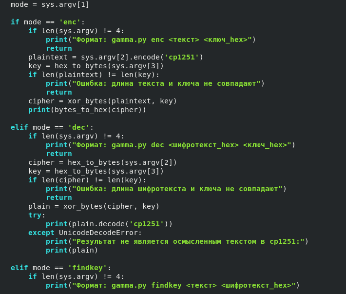
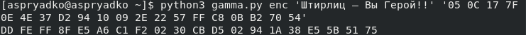
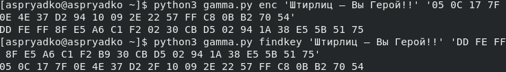
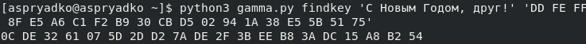
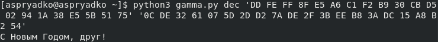
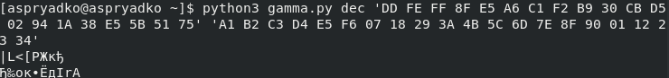

# Информация

## Докладчик

:::::::::::::: {.columns align=center}
::: {.column width="70%"}

  * Алексей Прядко

:::
::: {.column width="30%"}

:::
::::::::::::::

# Вводная часть

## Актуальность

- Однократное гаммирование (схема Вернама) обеспечивает абсолютную стойкость шифра
- Операция XOR лежит в основе многих криптографических протоколов
- Понимание принципов гаммирования необходимо для изучения современной криптографии

## Цели и задачи

**Цель:** Освоить на практике режим однократного гаммирования

**Задачи:**
1. Реализовать программу для шифрования и расшифрования методом XOR
2. Проверить корректность на примере из методички
3. Восстановить ключ по открытому тексту и шифротексту
4. Подобрать ключ для получения другого осмысленного сообщения
5. Продемонстрировать невозможность расшифрования без знания ключа

# Ход выполнения работы

## Программа gamma.py

- Написана на Python 3
- Поддерживает три режима: `enc`, `dec`, `findkey`
- Работает с текстами в кодировке cp1251, ключи и шифротекст в hex

{width=80%}

## Шифрование примера из методички

- Открытый текст: «Штирлиц – Вы Герой!!»
- Ключ: 05 0C 17 7F … 70 54
- Результат совпал с заданным шифротекстом

{width=90%}

## Восстановление ключа

- По известным открытому тексту и шифротексту
- Команда `findkey` вернула исходный ключ
- Подтверждает симметричность операции XOR

{width=90%}

## Подбор ключа для нового сообщения

- Задача: получить фразу «С Новым Годом, друг!»
- Исходная фраза «друзья!» длиннее, сокращена до 20 символов
- Найден новый ключ, преобразующий шифротекст в заданное сообщение

{width=90%}

## Расшифрование с новым ключом

- Полученный ключ позволил успешно расшифровать сообщение
- Вывод: «С Новым Годом, друг!»

{width=90%}

## Попытка со случайным ключом

- Использован заведомо неверный ключ
- Результат — нечитаемый набор символов
- Доказательство: без истинного ключа восстановить текст невозможно

{width=90%}

# Результаты

## Основные выводы

- Реализована программа для однократного гаммирования
- Показана возможность получения любого осмысленного сообщения путём подбора ключа
- Продемонстрирована абсолютная стойкость: случайный ключ не позволяет расшифровать текст
- Длина ключа должна строго совпадать с длиной открытого текста

# Заключение

## Итоги

- Лабораторная работа выполнена в полном объёме
- Изучены принципы работы схемы Вернама
- Практически освоены операции XOR-шифрования
- Полученные знания применимы в дальнейшем изучении криптографии

## Спасибо за внимание!

Вопросы?