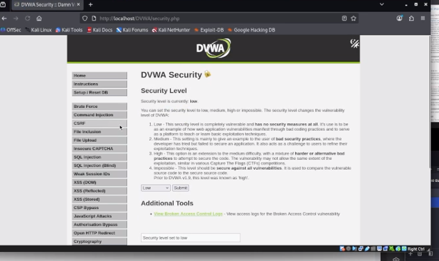
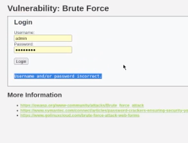
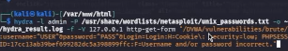
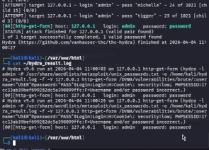

---
author:
  name: "Прядко Алексей Семенович"
  affiliation:
    - name: Российский университет дружбы народов
      country: Российская Федерация
title: "Отчёт по проекту"
subtitle: "Основы информационной безопасности: Тестирование веб-приложений"
license: "CC BY"
---

# Цель работы

Изучение основных способов тестирования веб-приложений на проникновение, получение навыков работы в ОС Kali Linux, настройка уязвимой среды DVWA и освоение инструментов автоматизированного подбора паролей (Hydra).

# Задание

1. Установить и настроить среду Kali Linux.
2. Развернуть специализированное уязвимое приложение Damn Vulnerable Web Application (DVWA).
3. Провести атаку методом перебора (Brute Force) на форму аутентификации с помощью утилиты Hydra.
4. Проверить корректность сохранения результатов в лог-файл.

# Теоретическое введение

Объектом исследования является **DVWA** — PHP/MySQL веб-приложение, созданное для легальной практики в поиске уязвимостей. Для атаки используется **Hydra** — сетевой взломщик, поддерживающий более 50 протоколов. При тестировании HTTP-форм Hydra имитирует запросы пользователя и анализирует ответ сервера на наличие специфических строк (например, сообщений об ошибке), чтобы определить успешность входа.

# Выполнение лабораторной работы

### Этап 1. Подготовка и анализ цели

Мною была развернута гостевая система Kali Linux и установлена среда DVWA. После успешного входа в систему под стандартными учетными данными (admin/password) был выбран раздел тестирования на устойчивость к перебору паролей (рис. @fig-001).

{#fig-001 width=70%}

Для настройки автоматизированной атаки необходимо определить маркер неудачного входа. При вводе некорректных данных страница выдает сообщение "Username and/or password incorrect." (рис. @fig-002). Эта строка будет использована Hydra в качестве условия для продолжения перебора.

{#fig-002 width=70%}

### Этап 2. Проведение атаки с помощью Hydra

Для проведения атаки был использован метод перебора по словарю `unix_passwords.txt`. Поскольку атака проводится на защищенный раздел, в команду был включен параметр `Cookie` (PHPSESSID), полученный из инструментов разработчика браузера. 

Команда запуска:
`hydra -l admin -P /usr/share/wordlists/metasploit/unix_passwords.txt -o ~/hydra_result.log -f -V 127.0.0.1 http-get-form ...`

{#fig-003 width=70%}

### Этап 3. Анализ результатов

После завершения работы утилита сохранила найденные данные в файл `hydra_result.log` в домашней директории пользователя. Проверка содержимого файла с помощью команды `cat` подтвердила успешное нахождение пароля для пользователя admin (рис. @fig-004).

{#fig-004 width=70%}

# Выводы

В ходе выполнения работы были освоены базовые навыки тестирования веб-приложений. На практике продемонстрирована уязвимость стандартных форм входа к атакам типа Brute Force при отсутствии ограничений на количество попыток ввода. Использование утилиты Hydra позволило автоматизировать процесс и успешно получить доступ к системе.

# Список литературы{.unnumbered}

1. Парасрам, Ш. Kali Linux: Тестирование на проникновение и безопасность. — СПб.: Питер, 2022.
2. Документация по использованию THC-Hydra: https://github.com/vanhauser-thc/thc-hydra