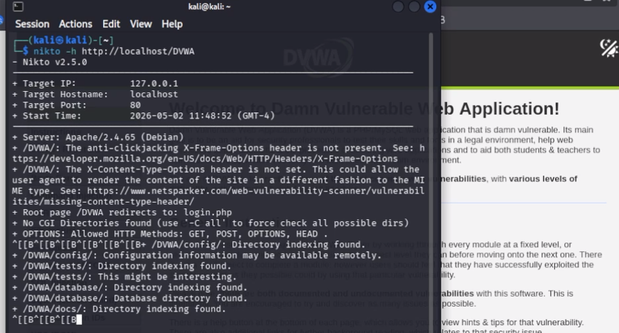
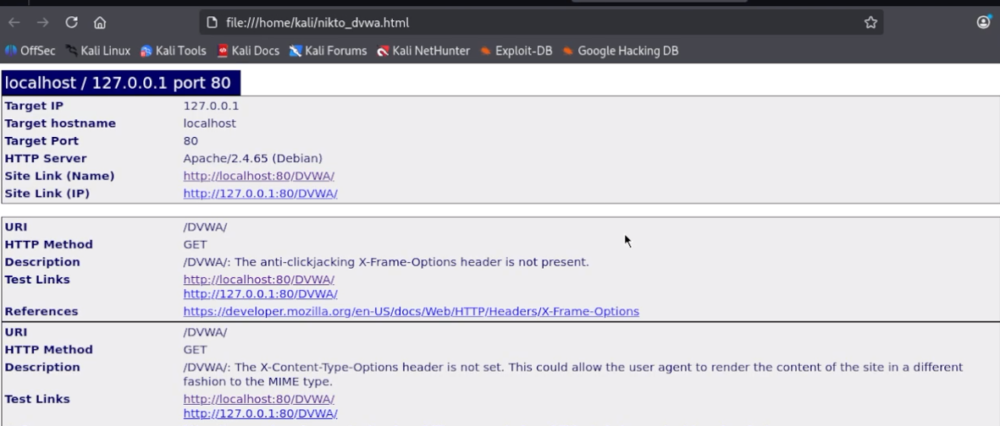
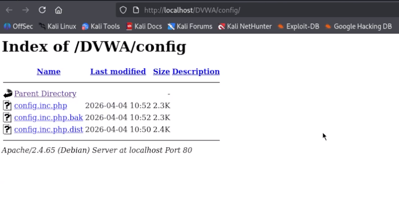
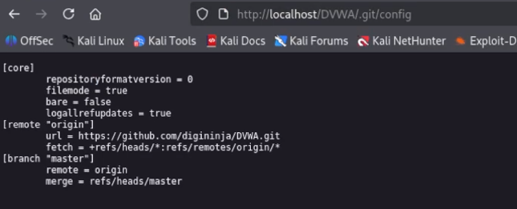

# Информация

## Докладчик

:::::::::::::: {.columns align=center}
::: {.column width="70%"}

  * Алексей Прядко

:::
::: {.column width="30%"}

:::
::::::::::::::

# Вводная часть

## Актуальность

- Сканеры безопасности веб-приложений позволяют быстро выявить
  типовые уязвимости конфигурации сервера
- nikto – один из базовых инструментов Kali Linux
- Результаты сканирования помогают определить направления
  для дальнейшего тестирования

## Цели и задачи

**Цель:** Освоить nikto для аудита безопасности DVWA

**Задачи:**
1. Запустить сканирование DVWA
2. Сохранить и проанализировать результаты
3. Провести ручную верификацию находок
4. Сделать выводы о защищённости стенда

# Ход выполнения работы

## Запуск nikto

- Команда: `nikto -h http://localhost/DVWA`
- Сканирование длилось 16 секунд
- Обнаружено 16 находок

{width=85%}

## Сохранение результатов

- HTML-отчёт: `nikto -h http://localhost/DVWA -o nikto_dvwa.html -Format html`
- Текстовый отчёт: `nikto -h http://localhost/DVWA -o nikto_dvwa.txt`
- HTML-версия открыта в браузере

{width=85%}

## Ключевые находки: заголовки безопасности

- Отсутствуют `X-Frame-Options`, `X-Content-Type-Options`
- Риск кликджекинга и MIME-сниффинга
- Также нет других защитных заголовков

## Листинг директорий

- Открыты каталоги:
  - `/DVWA/config/`
  - `/DVWA/tests/`
  - `/DVWA/database/`
  - `/DVWA/docs/`
- Можно увидеть все файлы

{width=85%}

## Утечка конфигурации

- Файл `config.inc.php.dist` читается как текст
- Содержит учётные данные БД:
  - `db_user = dvwa`
  - `db_password = p@ssw0rd`

{width=85%}

## Доступ к репозиторию Git

- Обнаружены файлы:
  - `/DVWA/.git/HEAD`
  - `/DVWA/.git/config`
- Раскрывают структуру и историю кода

{width=85%}

{width=85%}

## Ручная проверка

- Все находки подтверждены в браузере
- Страница входа `/DVWA/login.php` доступна без ограничений
- `config.inc.php` не отдаёт код (PHP-интерпретатор),
  но `.dist` успешно прочитан

# Результаты

## Основные выводы

- nikto обнаружил 16 проблем конфигурации
- Критические: доступ к `.git` и файлам конфигурации
- Отсутствие HTTP-заголовков ослабляет защиту клиента
- Полученные данные – основа для этапа 5 (Burp Suite)

# Заключение

## Итоги

- Инструмент nikto освоен
- Проведён аудит безопасности DVWA
- Результаты задокументированы
- Практические навыки готовы к применению

## Спасибо за внимание!

Вопросы?