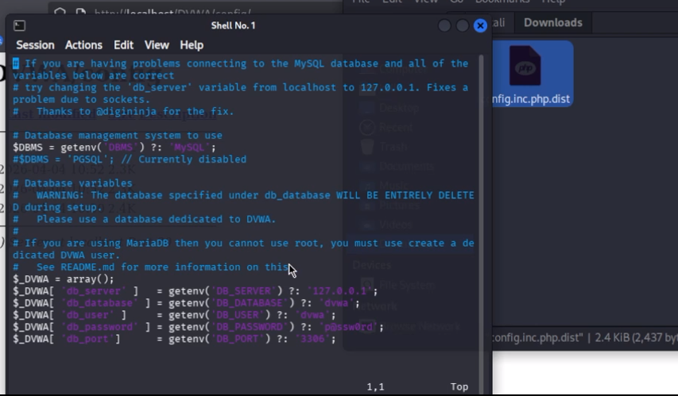
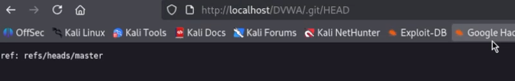

---
## Author
author:
  name: Алексей Прядко
  email: your.email@example.com
  affiliation:
      country: Россия

## Title
title: "Тестирование веб-приложений: использование nikto"
subtitle: "Индивидуальный проект, этап 4"
license: "CC BY"
---

# Цель работы

Освоить базовый инструмент сканирования безопасности веб-сервера **nikto** в составе Kali Linux.
Провести анализ защищённости учебного веб-приложения Damn Vulnerable Web Application (DVWA)
и выявить типовые уязвимости конфигурации.

# Задание

1. Убедиться, что DVWA развёрнуто и доступно по адресу `http://localhost/DVWA`.
2. Выполнить сканирование веб-сервера с помощью nikto.
3. Сохранить результаты сканирования в удобном виде (HTML и текстовый файл).
4. Проанализировать полученные находки, провести ручную верификацию наиболее критичных.

# Теоретическое введение

**nikto** – сканер безопасности веб-сервера с открытым исходным кодом,
входящий в состав Kali Linux. Он выполняет комплексные проверки:

- обнаружение более 6700 потенциально опасных файлов и CGI-скриптов;
- определение устаревших версий веб-сервера и его компонентов;
- анализ HTTP-заголовков и параметров безопасности;
- выявление неправильных конфигураций, таких как листинг директорий
  и возможность обзора чувствительных файлов.

Nikto не является инструментом эксплуатации уязвимостей, но служит
быстрым и надёжным средством аудита конфигурации. В учебном стенде DVWA
(Damn Vulnerable Web Application) намеренно собраны распространённые
ошибки безопасности, что делает его идеальной целью для практики.

# Выполнение этапа 4

## Запуск сканирования

После подтверждения доступности DVWA (страница входа открывается по
адресу `http://localhost/DVWA`) в терминале Kali Linux была выполнена команда:

    nikto -h http://localhost/DVWA

Сканирование заняло 16 секунд и завершилось обнаружением 16 находок
(рис. @fig-nikto-term).

{#fig-nikto-term width=90%}

## Сохранение результатов

Для более удобного анализа и вставки в документацию отчёт был сохранён
в двух форматах:

    nikto -h http://localhost/DVWA -o nikto_dvwa.html -Format html
    nikto -h http://localhost/DVWA -o nikto_dvwa.txt

HTML-отчёт открыт в браузере и демонстрирует структурированную таблицу
с находками (рис. @fig-nikto-html).

{#fig-nikto-html width=90%}

## Анализ находок

Наиболее критичные результаты:

- **Отсутствие защитных HTTP-заголовков**: `X-Frame-Options` и
  `X-Content-Type-Options` не установлены. Это увеличивает риск
  кликджекинга и MIME-сниффинга.
- **Листинг директорий**:
  - `/DVWA/config/`
  - `/DVWA/tests/`
  - `/DVWA/database/`
  - `/DVWA/docs/`

  Открытый листинг каталога `/DVWA/config/` показан на рис. @fig-dir-index.
  Злоумышленник видит имена файлов и может обратиться к каждому из них напрямую.

{#fig-dir-index width=90%}

- **Утечка конфигурационного файла**: Файл `config.inc.php.dist` не
  интерпретируется PHP-обработчиком и отдаётся сервером как обычный текст.
  В нём содержатся учётные данные базы данных (рис. @fig-dist-file):

      $_DVWA[ 'db_user' ]     = 'dvwa';
      $_DVWA[ 'db_password' ] = 'p@ssw0rd';

{#fig-dist-file width=90%}

- **Доступ к файлам системы Git**:
  - `/DVWA/.git/HEAD` – раскрывает текущую ветку репозитория (рис. @fig-git-head).
  - `/DVWA/.git/config` – содержит конфигурацию удалённого репозитория (рис. @fig-git-config).
  
  Наличие этих файлов позволяет атакующему извлечь полную историю исходного
  кода с помощью утилит типа `git-dumper`.

{#fig-git-head width=90%}

{#fig-git-config width=90%}

- **Страница входа** `/DVWA/login.php` доступна без ограничений, что
  облегчает атаки перебора паролей (см. этап 3).

- Присутствуют также файлы `.gitignore` и `.dockerignore`, раскрывающие
  внутреннюю структуру проекта.

## Ручная верификация

Все указанные находки подтверждены ручной проверкой в браузере: переход
по адресам, отображение содержимого файлов. Попытка доступа к
`config.inc.php` вернула пустой ответ, что объясняется исполнением
PHP-кода на сервере, однако соседний файл `.dist` позволил успешно
прочитать конфигурацию.

# Выводы

- Сканирование nikto выявило **16 проблем конфигурации** веб-сервера,
  обслуживающего DVWA.
- Наиболее серьёзными являются доступ к каталогу `.git` и чтение
  конфигурационного файла с паролем базы данных, что может привести
  к полной компрометации приложения.
- Отсутствие современных HTTP-заголовков безопасности снижает защиту
  от атак на стороне клиента.
- Полученные результаты послужат основой для дальнейшего тестирования
  с помощью Burp Suite (этап 5) и демонстрируют важность правильной
  настройки web-сервера.

# Список литературы{.unnumbered}

1. Парасрам, Ш. Kali Linux: Тестирование на проникновение и безопасность :
   Для профессионалов. – Санкт-Петербург : Питер, 2022. – 448 с.
2. Nikto – Documentation and Usage.
   [https://github.com/sullo/nikto/wiki](https://github.com/sullo/nikto/wiki).