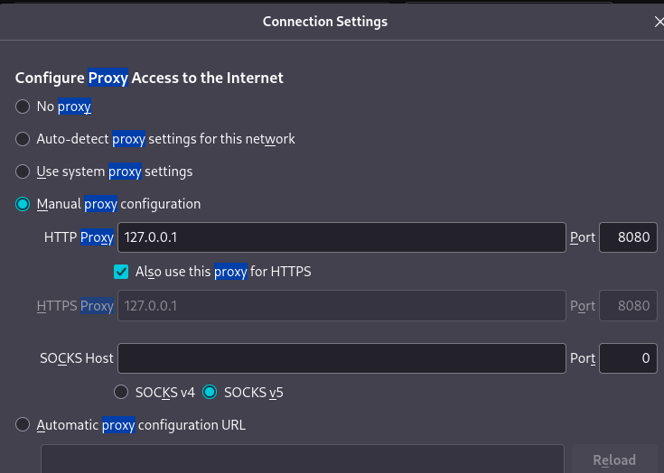
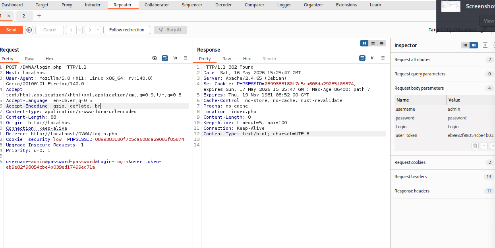
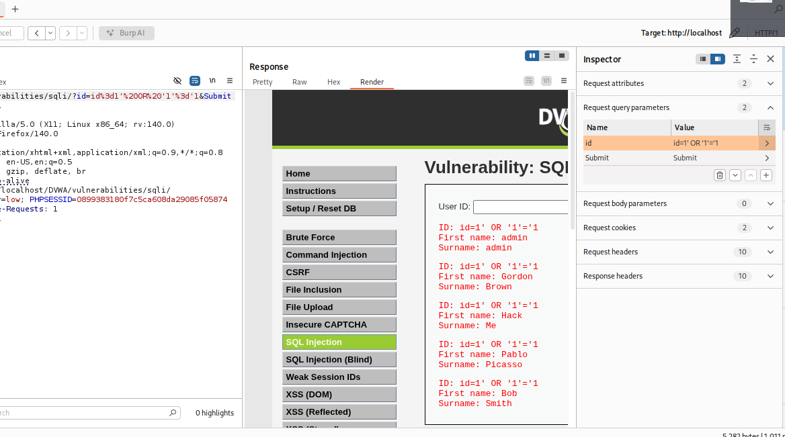

# Информация

## Докладчик

:::::::::::::: {.columns align=center}
::: {.column width="70%"}

  * Алексей Прядко

:::
::: {.column width="30%"}

<!-- Фото можно добавить -->
<!--  -->

:::
::::::::::::::

# Вводная часть

## Актуальность

- Burp Suite – мощный инструмент для тестирования безопасности веб-приложений
- Позволяет перехватывать, анализировать и модифицировать HTTP-трафик
- SQL Injection остаётся одной из самых опасных уязвимостей
- Практика на DVWA даёт базовые навыки пентестера

## Цели и задачи

**Цель:** Освоить Burp Suite для обнаружения и эксплуатации уязвимостей

**Задачи:**
1. Настроить прокси-перехват между браузером и Burp Suite
2. Перехватить и модифицировать запросы аутентификации
3. Эксплуатировать SQL Injection на низком уровне безопасности
4. Проанализировать результаты

# Ход выполнения работы

## Настройка Burp Suite и браузера

- Запущен Burp Suite (Temporary project)
- На вкладке Proxy → Options активен слушатель на `127.0.0.1:8080`
- В Firefox настроен прокси и разрешён перехват локального трафика

{width=85%}

## Перехват запроса входа в DVWA

- При попытке входа Burp перехватил POST-запрос на `/DVWA/login.php`
- В теле запроса видны параметры `username` и `password`
- Запрос отправлен в Repeater для модификации

{width=85%}

## Успешная аутентификация через Repeater

- В Repeater изменены параметры на `admin` / `password`
- Сервер вернул редирект на `index.php` – вход успешен
- Демонстрирует возможность ручного манипулирования запросами

{width=85%}

## Эксплуатация SQL Injection

- Раздел SQL Injection (Low), запрос `id=1` перехвачен
- В Repeater параметр изменён на `id=1' OR '1'='1`
- Ответ сервера содержит записи всех пользователей (admin, Gordon, Hack...)

{width=85%}

# Результаты

## Основные выводы

- Burp Suite позволяет легко анализировать и модифицировать HTTP-запросы
- С помощью Repeater выполнена успешная аутентификация
- Уязвимость SQL Injection эксплуатирована – получены конфиденциальные данные
- Подтверждена необходимость строгой валидации ввода и использования параметризованных запросов

# Заключение

## Итоги

- Инструмент Burp Suite освоен на практике
- Проведено тестирование DVWA с перехватом трафика и эксплуатацией уязвимости
- Полученные навыки применимы в реальных задачах пентеста

## Спасибо за внимание!

Вопросы?