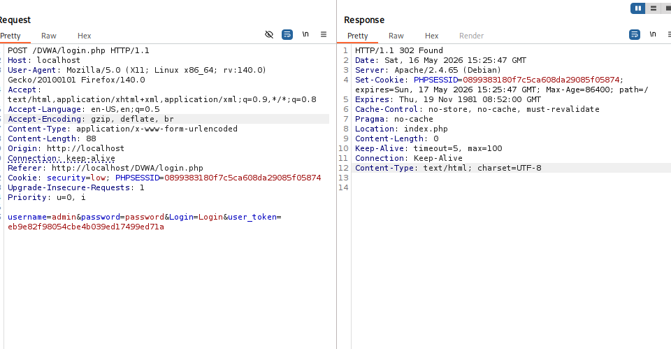

---
## Author
author:
  name: Алексей Прядко

## Title
title: "Тестирование веб-приложений: использование Burp Suite"
subtitle: "Индивидуальный проект, этап 5"
license: "CC BY"
---

# Цель работы

Освоить базовые инструменты Burp Suite для тестирования безопасности веб-приложений. Провести анализ защищённости Damn Vulnerable Web Application (DVWA) и продемонстрировать эксплуатацию уязвимости SQL Injection.

# Задание

1. Запустить и настроить Burp Suite и браузер для перехвата HTTP-трафика.
2. Перехватить и проанализировать запрос аутентификации к DVWA.
3. Изучить параметры запроса с помощью инструмента Repeater.
4. Обнаружить и эксплуатировать уязвимость SQL Injection на низком уровне безопасности.

# Теоретическое введение

**Burp Suite** — интегрированная платформа для тестирования безопасности веб-приложений, входящая в состав Kali Linux. Основные инструменты:

- **Proxy** — перехватывает HTTP/HTTPS-запросы между браузером и сервером, позволяя анализировать и изменять трафик.
- **Repeater** — даёт возможность модифицировать и повторно отправлять запросы для детального изучения ответов.
- **Intruder** — автоматизирует атаки на параметры запроса (например, перебор паролей).

**SQL Injection** — уязвимость, возникающая при внедрении SQL-кода в поля ввода. В DVWA она присутствует на низком уровне безопасности и позволяет получить доступ к данным всех пользователей.

# Выполнение этапа 5

## Настройка Burp Suite и браузера

После запуска Burp Suite выбран временный проект с настройками по умолчанию. На вкладке **Proxy → Options** проверен активный слушатель на `127.0.0.1:8080` (рис. @fig-listener).

{#fig-listener width=90%}

В браузере Firefox установлен прокси `127.0.0.1:8080` для всех протоколов. Через `about:config` параметр `network.proxy.allow_hijacking_localhost` включён, чтобы Burp мог перехватывать запросы к локальному DVWA.

## Перехват запроса аутентификации

При попытке входа в DVWA с любыми учётными данными Burp перехватил POST-запрос на `/DVWA/login.php`. В теле запроса видны параметры `username` и `password` (рис. @fig-intercept).

{#fig-intercept width=90%}

Запрос отправлен в Repeater для дальнейшего анализа.

## Работа в Repeater: проверка успешной аутентификации

В Repeater параметры запроса изменены на `username=admin&password=password`. После отправки сервер вернул ответ с редиректом на `index.php`, что подтверждает успешную аутентификацию (рис. @fig-admin).

{#fig-admin width=90%}

## Эксплуатация SQL Injection

В разделе **SQL Injection** (уровень Low) выполнен запрос с `id=1`. Он перехвачен и отправлен в Repeater. Параметр изменён на `id=1' OR '1'='1`. В ответе сервер вернул данные всех пользователей: admin, Gordon, Hack, Pablo, Bob (рис. @fig-sqli). Это подтверждает успешную эксплуатацию уязвимости.

{#fig-sqli width=90%}

Таким образом, злоумышленник может извлечь конфиденциальную информацию из базы данных.

# Выводы

- Burp Suite предоставляет удобные инструменты для перехвата и модификации HTTP-запросов.
- С помощью Repeater удалось изменить параметры аутентификации и изучить ответы сервера.
- Уязвимость SQL Injection на низком уровне безопасности DVWA позволила получить доступ к данным всех пользователей, что демонстрирует критическую важность валидации ввода и использования параметризованных запросов.
- Полученные навыки послужат основой для дальнейшего тестирования веб-приложений.

